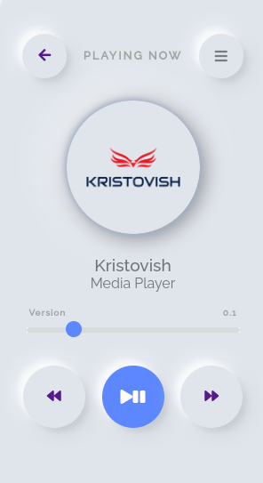

# kristovish-media-player-v1.0

## Table of Contents
1. [General Info](#general-info)
2. [Technologies](#technologies)
3. [Installation](#installation)
4. [Collaboration](#collaboration)


### General Info
***
Sometimes, I just want to hear something good withouth looking for it. I love music but not search it. for that reason I prefer to turn the radio on. I made this tool for myself to get music in one click. 

For the moment, I just added 4 of the radios that I like most:

Capitol
Cosmos
Dance
Rock

Visit it in the next link, enjoy!
https://kristovish.github.io/kristovish-media-player-v1.0/index_kristovish.html

### Screenshot

## Technologies
***
This is a simple HTML/CSS/JS project

## Installation
***
A little intro about the installation if you want to make some changes for yourself.
```
$ git clone https://github.com/kristovish/kristovish-media-player-v1.0.git

```
## Collaboration
***
Any idea or advice will be really appreciate it. the project its not finish

TODO:

/Improve the menu and button system
/Add more radios
/mozilla compatibility 